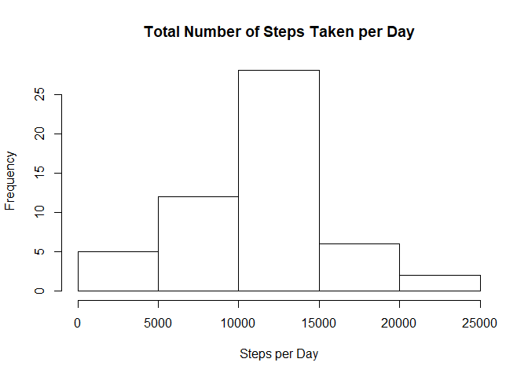
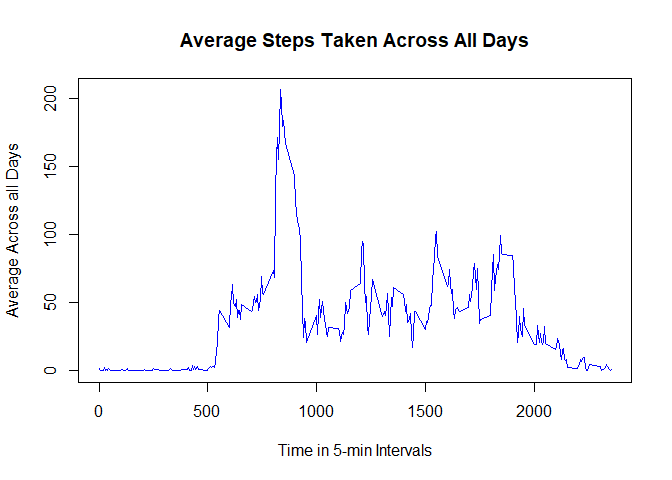
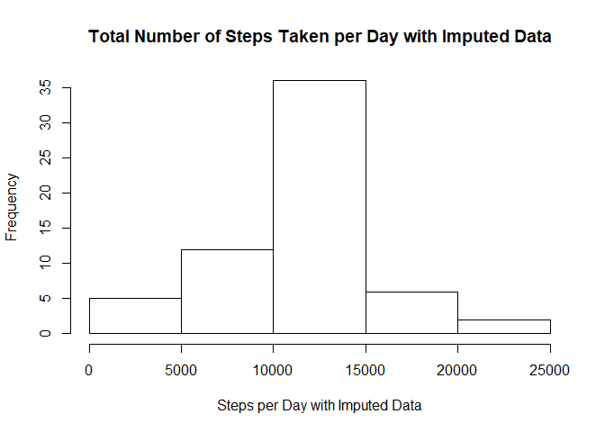

Reproducible Research Project 1
================

Reproducible Research Project
-----------------------------

Dataset: <https://d396qusza40orc.cloudfront.net/repdata%2Fdata%2Factivity.zip> Downloaded:

``` r
Sys.Date()
```

    ## [1] "2018-01-13"

### Loading and preprocessing the data

To read in the downloaded and unzipped data files:

``` r
data <- read.csv("activity.csv")
```

### What is mean total number of steps taken per day?

To explore the number of steps, calculate the total steps per day, along with the MEAN and MEDIAN.

``` r
total_steps <- tapply(data$steps, data$date, sum)
hist(total_steps, xlab = "Steps per Day", main = "Total Number of Steps Taken per Day")
```



``` r
mean(total_steps, na.rm=T)
```

    ## [1] 10766.19

``` r
median(total_steps, na.rm=T)
```

    ## [1] 10765

### What is the average daily activity pattern?

To visualize the daily activity pattern, calculate the average steps of each 5 minute interval across all the days. We plot as a line graph.

To determine the 5-minute interval with the maximum number of steps, call the MAX and WHICH.MAX function to see the highest number of steps and the corresponding interval.

``` r
interval_steps <- tapply(data$steps, data$interval, mean, na.rm=T)
plot(row.names(interval_steps), interval_steps, type = "l", 
     xlab = "Time in 5-min Intervals", ylab = "Average Across all Days",
     main = "Average Steps Taken Across All Days", col = "blue")
```



``` r
max(interval_steps)
```

    ## [1] 206.1698

``` r
which.max(interval_steps)
```

    ## 835 
    ## 104

### Imputing missing values

The raw data contains a number of NA values that might be influencing the results. To investigate, we imput the missing step values with the interval average across all days.

How many NA step values are in the dataset?

``` r
sum(is.na(data$steps))
```

    ## [1] 2304

To replace the NA values with the interval average:

``` r
adj_data <- data
int_steps <- aggregate(steps ~ interval, data = data, mean, na.rm = TRUE) 
for( i in 1:nrow(adj_data)){
  
  if(is.na(adj_data[i,]$steps)){
    adj_data[i,]$steps <- int_steps[int_steps$interval == adj_data[i,]$interval, ]$steps
    
  }
}
```

The new imputed dataset (adj\_data) is used to re-examine the original histogram plot and mean/median

``` r
total_adj_steps <- tapply(adj_data$steps, adj_data$date, sum)
hist(total_adj_steps, xlab = "Steps per Day with Imputed Data", 
     main = "Total Number of Steps Taken per Day with Imputed Data")
```



``` r
mean(total_adj_steps, na.rm=T)
```

    ## [1] 10766.19

``` r
median(total_adj_steps, na.rm=T)
```

    ## [1] 10766.19

Comparing the results to our earlier work, we see the replacement of the NAs has had no impact on the average (as average values were used as the substitute), but the median of the dataset has slightly increased.

### Are there differences in activity patterns between weekdays and weekends?

To start, we convert the dates in the dataset to days of the week and then evaluate if they are Weekends or Weekdays.

``` r
# assign day of the week:
adj_data$day <- weekdays(as.Date(adj_data$date, "%Y-%m-%d"))

# assign weekend or weekday:
for( i in 1:nrow(adj_data)){
  
  if(adj_data$day[i] == "Saturday" || adj_data$day[i] == "Sunday")
    {adj_data$day_type[i] <- "Weekend"}
  else
    {adj_data$day_type[i] <- "Weekday"}
  
}
```

We can visually compare activity between weekdays and weekends in a plot.

``` r
library(lattice)
step_days <- aggregate( steps ~ interval + day_type, data = adj_data, mean)

xyplot(steps ~ interval | day_type, data = step_days, layout = c(1,2), 
       type = "l", xlab = "5-Minute Intervals" , ylab = "Average Steps", 
       main = "Average Steps Across All Days (Imputed)" )
```


From the plot we can observe less peak steps on the weekend, but more intervals that exceed 100 steps on the weekends.
